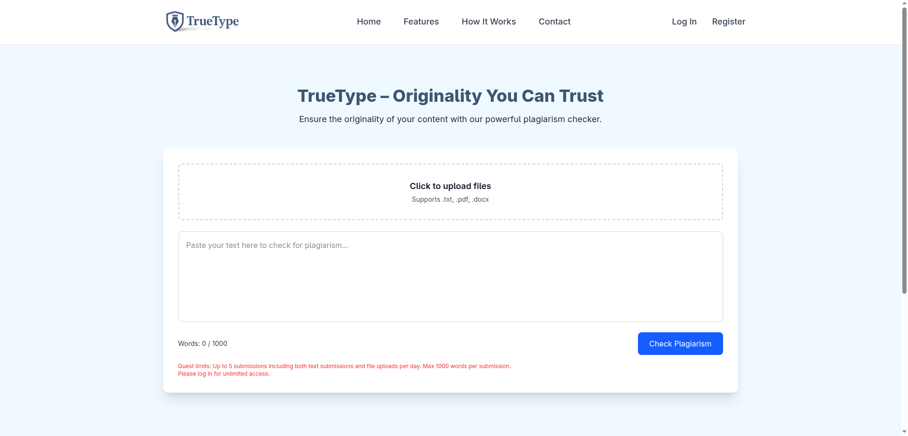
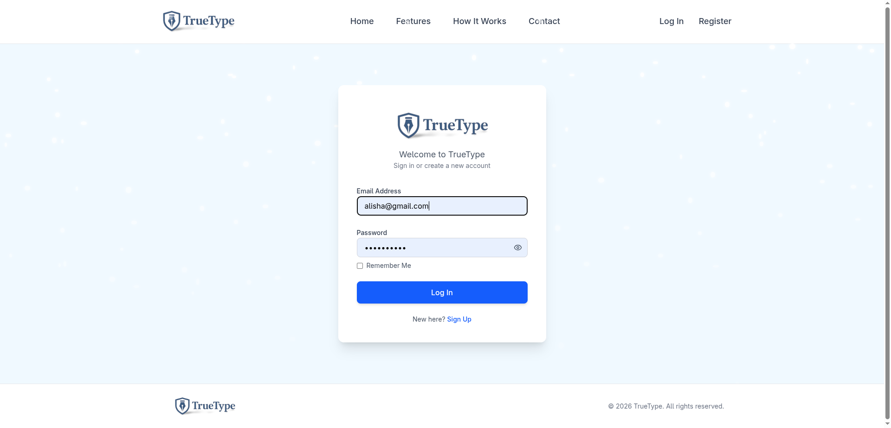
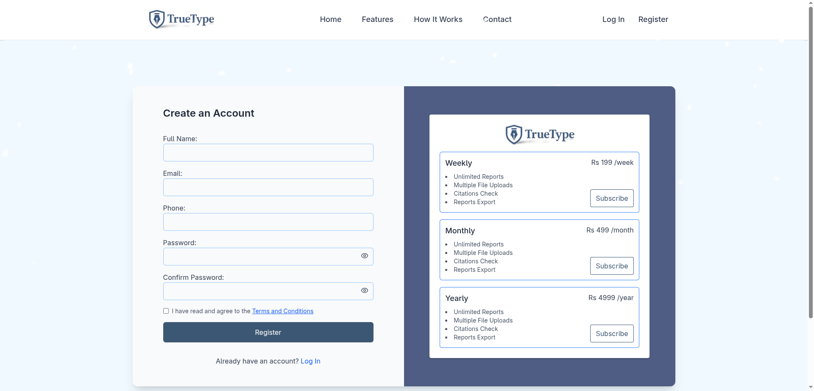
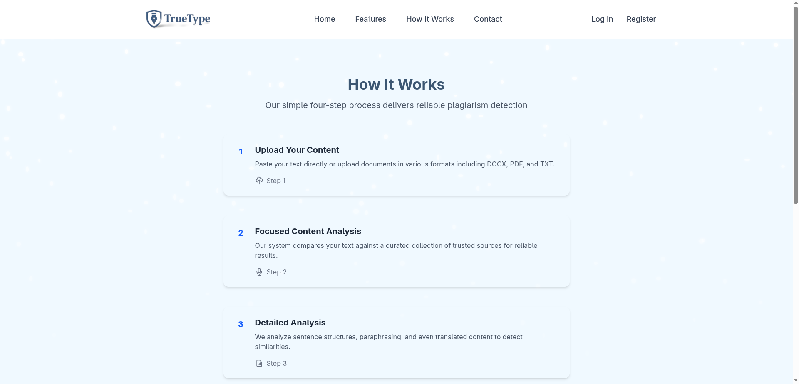
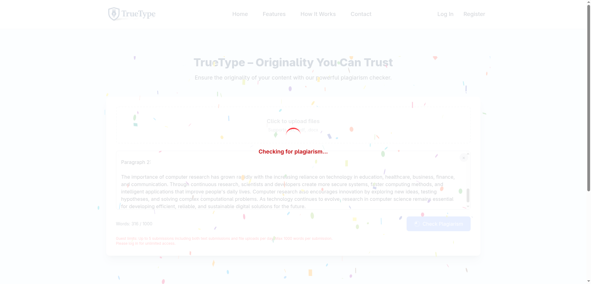
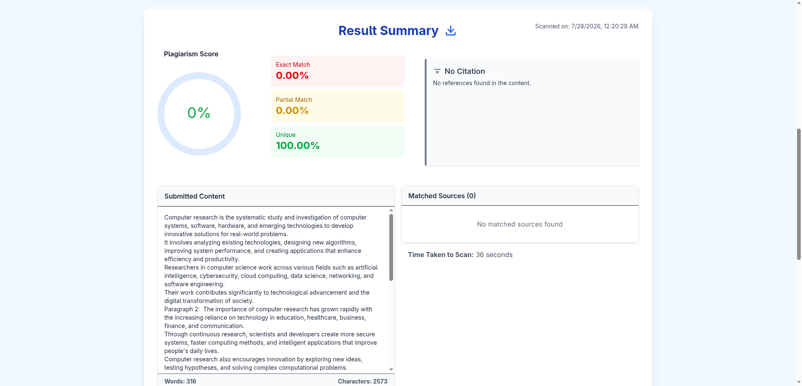

# Plagiarism Detection Frontend

A modern and responsive frontend for a **Plagiarism Detection System** that allows users to upload documents, analyze text similarity, and view plagiarism results through an intuitive interface.

## 🚀 Features

- User Authentication (Login & Registration)
- Responsive and user-friendly interface
- Document and text submission
- View plagiarism analysis results
- User profile and settings
- Password reset functionality
- Resource management
- Reports dashboard
- Payment UI integration
- Protected routes for authenticated users

## 🛠️ Tech Stack

### Frontend
- React
- JavaScript
- CSS
- HTML
- React Router
- Axios

### Backend (Integrated)
- Node.js
- Express/Fastify
- PostgreSQL

### Analysis Engine
- Python

## 📸 Screenshots

### 🏠 Homepage



---

### 🔐 Login Page



---

### 📝 Signup Page



---

### 📂 Document Upload



---

### ⏳ Processing



---

### 📊 Plagiarism Result



## 📂 Project Structure

```
src/
│
├── api/
├── api_helper/
├── auth/
├── components/
├── pages/
├── utils/
```

---

## ⚙️ Installation

Clone the repository

```bash
git clone https://github.com/lazyanusha/Plagiarism-detection-frontend.git
```

Move into the project

```bash
cd Plagiarism-detection-frontend
```

Install dependencies

```bash
npm install
```

Start the development server

```bash
npm run dev
```

---

## backend link 
https://github.com/lazyanusha/plagiarismbackend

## 🔗 Backend

This frontend communicates with a backend API developed using Node.js and PostgreSQL and integrates a Python-based plagiarism detection module.

---

## 💡 Project Highlights

- Built with reusable React components
- Responsive design for desktop and mobile
- REST API integration
- Authentication and protected routes
- Clean and maintainable code structure
- Real-world academic plagiarism detection workflow

---

## 👩‍💻 Author

**Anusha Shrestha**

GitHub: https://github.com/lazyanusha

---

## 📄 License

This project is created for educational and portfolio purposes.